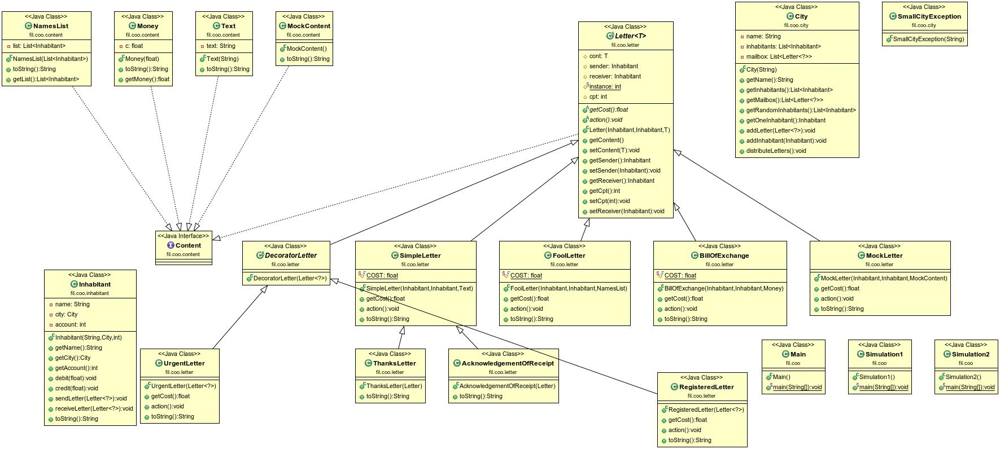

# Projet COURRIERS 
## Auteurs:
 **Filali Youva**
## Introduction du sujet:
**Le Projet Courriers** est un projet qui consiste a pouvoir gérer la distribution des **Courriers** envoyé par des habitants (*Inhabitant*) à d'autres dans une Ville (*City*). Ce mécanisme se fait en plusieurs étapes:
1. Un habitant (*Inhabitant*) envoie une lettre (*Letter*) à un autre, du coup la lettre est mit dans la boite au lettres (*Mailbox*) de la ville (*City*).
2. Le contenu de la boite au lettres (*Mailbox*) est ditribué aux destinataires.
3. L'action de la lettre (*Letter*) est déclenché selon sa nature.

2 Simulations ont été créé pour ce projet. 
* La première créé une ville et des habitants, ces dernièrs s'envoient des Lettres de natures choisies au hasard pour un nombre n de jour. 
* La deuxième consiste à crée une chaine à naif (*FoolLetter*) en commencant par une seul *FoolLetter* et vérifier le solde de l'habitant le plus riche de la ville à la fin de la simulation. Un habitant à une chance de 15% de répondre à ce genre de Lettre.

## How To:
Pour utiliser le projet:

#### Se positionner dans la racine du projet:

Faut se positionner dans la racine du projet **COURRIERS** avec la commande:

`cd COO-COURRIERS`

#### Générer la JavaDoc:

`mvn javadoc:javadoc`

La Javadoc généré se retrouvera donc dans *target/docs*.

#### Générer le Projet:

`mvn package`

#### Execution de l'archive généré:

Pour éxécuter la première simulation:

`java -jar target/COO-COURRIERS-1.0-SNAPSHOT.jar`

Pour éxécuter la deuxième simulation, deux solutions s'offrent à vous:

*La première qui est la plus simple:*
Executez cette commande:

`java -cp target/COO-COURRIERS-1.0-SNAPSHOT.jar fil.coo.Simulation2`

*La deuxième solution:*

Modifiez le fichier *.pom* pour que Main Class soit: fil.coo.Simulation2 et refaites la même étape pour que vous avez fait pour éxécuter la première simulation.

## Diagramme UML:

## Présentation d'élement du code (ce qui est intéressant):

* Utilisation des classes génériques
* Utilisation des Mocks pour les tests (MockLetter et MockContent)
* Utilisation de compteur auto incrementant dans la creation des lettres

## Design patterns et principe SOLID:
* Decorator utilisé dans plusieurs classes de Lettres. (RegisteredLetter, UrgentLetter)
* Utilisation de Factory Method dans les tests.
* Principe SOLID plus au moins respecté, on a essayé au maximum de séparer les responsabilités (pour donner un exemple dans City: getRandomInhabitants et getOneInhabitant).
